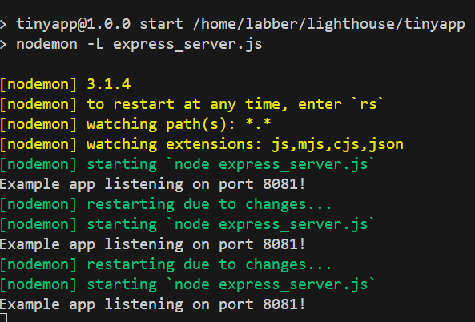
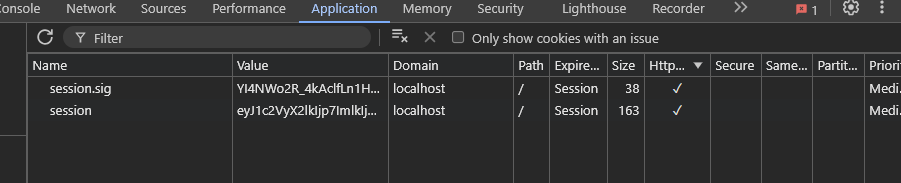
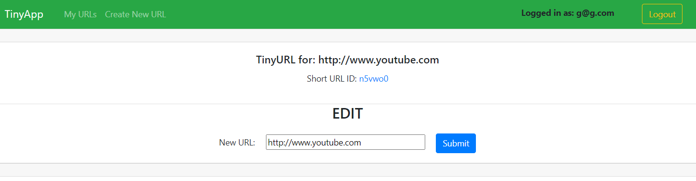
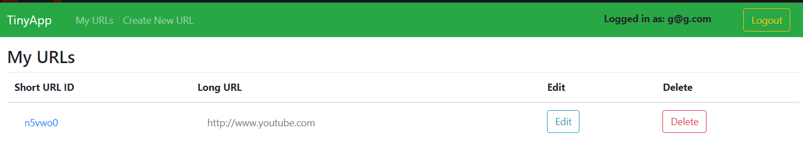

# Tiny App Project

---


---

TinyApp is a full stack web application built with Node and Express that allows users to shorten long URLs (à la bit.ly).

---

## Dependencies

- Node.js
- Express
- EJS
- bcryptjs
- cookie-session

---

## Getting Started

- Install all dependencies (using the `npm install` command).
- Run the development web server using the `node express_server.js` command.

Port number can be changed on ```const PORT = 8081``` in line 10 of the ```express_server.js``` file if `port 8081` is occupied.

---

To go to the `login` page enter
```localhost:<PORT NUMBER>/login``` or ```localhost:<PORT NUMBER>/```</br><br>

---

## Final Product

---







---


---
The default PORT is `8081`

