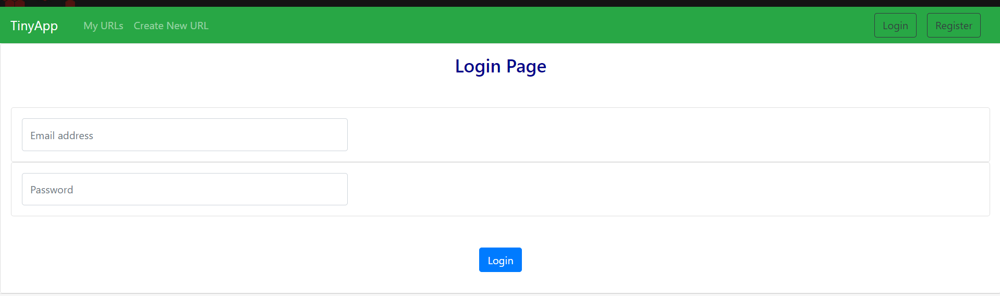

# Tiny App 
---
### by Anthony Anuebunwa
---
On your system where the folder `./tinyapp` is located install dependencies with ```npm init && npm i ejs && npm i express```.</br>
You may also need to install [`cookie-parser`](https://github.com/expressjs/cookie-parser) </br> with ```npm i cookie-parser```.</br>
You may also install `nodemon` </br> with ```npm i -g nodemon```

if `nodemon` is installed start the server with ```npm start```
else use ```node express_server.js```

Port number can be changed on ```const PORT = 8081``` in line 10 of the ```express_server.js``` file if `port 8081` is occupied.
---





---
The default PORT is `8081`

